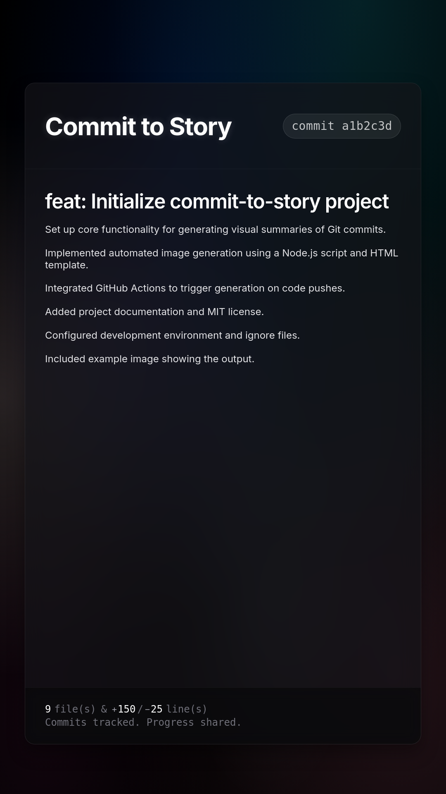

# Commit to Story

[](https://github.com/lafittemehdy/commit-to-story/actions/workflows/generate-story.yml) [](https://pnpm.io/)

This project automatically generates visual summaries of Git commits, formatted as images. These images are ideal for sharing project updates or creating a visual "story" of development, similar in concept to an Instagram Story. Each generated image includes the commit message, SHA, and diff statistics.



## How It Works

The core of this system is a GitHub Actions workflow, which uses a Node.js script to perform the following steps:

1.  **Trigger**: The workflow (defined in `.github/workflows/generate-story.yml`) is initiated upon each push to a designated branch (default: `main`).
2.  **Environment Setup**: It configures a Node.js environment and installs necessary dependencies, including Puppeteer.
3.  **Commit Data Extraction**: Extracts key information from the latest commit:
    *   Commit SHA (short and full)
    *   Commit message (subject and body)
    *   Diff statistics (files changed, lines added, lines deleted)
4.  **Image Generation**:
    *   The extracted commit data is processed by a Node.js script ([`.github/commit-story/generate-commit-image.js`](.github/commit-story/generate-commit-image.js:1)) and used to populate an HTML template ([`.github/commit-story/commit-story-template.html`](.github/commit-story/commit-story-template.html:1)).
    *   Puppeteer renders this HTML in a headless Chromium browser and captures a screenshot. The default output is a 1080x1920 PNG, suitable for common story formats.
5.  **Artifact Upload**: The generated image (e.g., `commit-story-<short_sha>.png`) is uploaded as a GitHub Actions artifact, accessible from the workflow run summary.

## Setup

### GitHub Actions Integration

To integrate this into your GitHub repository:

1.  **Incorporate Project Files:**
    *   Copy the `.github/commit-story/` directory (containing `generate-commit-image.js` and `commit-story-template.html`) into your repository's `.github/` folder.
    *   Copy the `.github/workflows/generate-story.yml` file into your repository's `.github/workflows/` folder.
2.  **Add Dependency:**
    Ensure `puppeteer` is listed as a project dependency. For `pnpm` (as used in the default workflow):
    ```bash
    pnpm add puppeteer
    ```
    (Adjust the installation command if using `npm` or `yarn` and modify the workflow's install step accordingly.)
3.  **Deployment:**
    Commit and push these changes. The workflow will execute on pushes to the configured branch. Generated images will be available as downloadable artifacts.

### Local Development Environment

For local testing and development:

1.  **Install Dependencies:**
    ```bash
    pnpm install
    ```
2.  **Environment Configuration:**
    The script uses environment variables, prioritizing a local `.env` file (which should be gitignored). If `.env` is absent, it falls back to `.env.development` (which contains default committed values).
    To set up local variables:
    ```bash
    cp .env.development .env
    ```
    Then, modify the `.env` file as required.
3.  **Image Generation (Local):**
    ```bash
    pnpm run generate
    ```

## Project Structure

- [` .github/workflows/generate-story.yml`](.github/workflows/generate-story.yml) - GitHub Actions workflow definition.
- [` .github/commit-story/generate-commit-image.js`](.github/commit-story/generate-commit-image.js) - Node.js script for image generation.
- [` .github/commit-story/commit-story-template.html`](.github/commit-story/commit-story-template.html) - HTML template for the generated image.
- [` package.json`](package.json) - Project metadata, dependencies, and script definitions.
- [` .env.development`](.env.development) - Default environment variables for local development.

## Customization Options

The following components can be customized:

- **Visual Appearance:** Modify the HTML template ([`.github/commit-story/commit-story-template.html`](.github/commit-story/commit-story-template.html)) to alter the design of the generated images.
- **Image Generation Process:** Adjust the Node.js script ([`.github/commit-story/generate-commit-image.js`](.github/commit-story/generate-commit-image.js)) to change image parameters (e.g., dimensions, format) or data processing logic.
- **Workflow Configuration:** Update the GitHub Actions workflow file ([`.github/workflows/generate-story.yml`](.github/workflows/generate-story.yml)) to modify triggers (e.g., target branches), Node.js versions, or other CI/CD parameters.

## License

This project is licensed under the MIT License - see the [`LICENSE`](LICENSE) file for details.

## Author

**Mehdy Lafitte** - [GitHub](https://github.com/lafittemehdy)